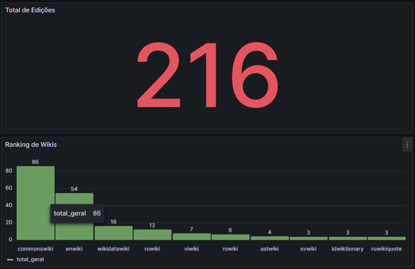

# 🚀 Real-Time Streaming Pipeline

Pipeline de dados em tempo real para ingestão, processamento e armazenamento 
de eventos de edições da Wikipedia.

## Dashboard ao vivo



## Arquitetura
```
Wikipedia Stream → Kafka → Flink → Apache Iceberg → DuckDB → Grafana
```

## Stack
- **Kafka** — ingestão e transporte de eventos com particionamento por wiki
- **Apache Flink** — processamento em tempo real com Tumbling Window de 60s
- **Apache Iceberg** — armazenamento lakehouse com ACID e time travel
- **DuckDB** — consultas analíticas no lakehouse
- **Grafana** — dashboard em tempo real
- **Docker Compose** — orquestração local de 5 containers

## Decisões de Arquitetura
- **Chave de particionamento:** wiki — garante ordem cronológica por wiki
- **Tumbling Window:** 60s — balanceia latência e volume de dados
- **Iceberg vs Parquet puro:** ACID transactions para escritas concorrentes do Flink
- **DuckDB:** consultas analíticas sem servidor, zero configuração

## Como rodar

**Subir infraestrutura:**
```bash
docker compose up -d
```

**Criar tópico Kafka:**
```bash
docker exec -it kafka bash
kafka-topics --create --topic wikipedia-events --bootstrap-server localhost:29092 --partitions 3 --replication-factor 1
```

**Rodar o pipeline:**
```bash
python -m venv .venv && source .venv/bin/activate
pip install -r requirements.txt
python producer/producer.py      # Terminal 1
python processing/wikipedia_job.py  # Terminal 2
python monitoring/metrics_api.py    # Terminal 3
```

**Acessar Grafana:** http://localhost:3000

## Status do Projeto
- [x] Ambiente Docker com Kafka + Zookeeper + Flink
- [x] Producer Python consumindo Wikipedia EventStream em tempo real
- [x] Consumer Python lendo eventos do Kafka
- [x] Flink job com Tumbling Window agregando edições por wiki
- [x] Apache Iceberg — persistência ACID com time travel
- [x] DuckDB — consultas analíticas no lakehouse
- [x] Grafana dashboard com métricas em tempo real